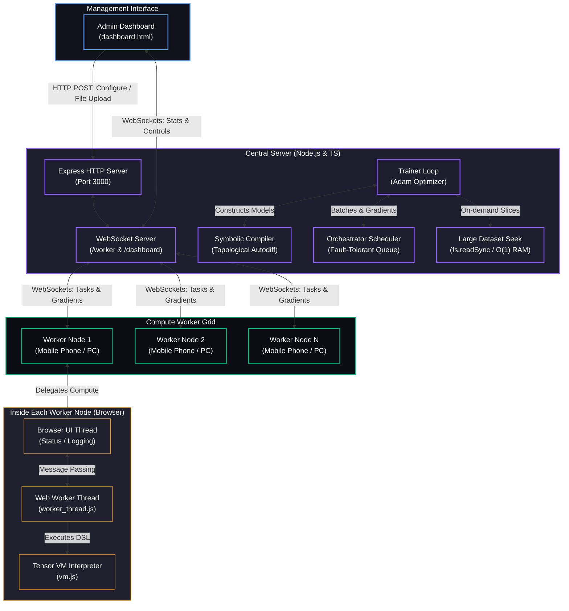

# Distributed Compute Cluster for LLM Training

A real-time, fault-tolerant, distributed deep learning training system that orchestrates browser-based compute workers (such as mobile phones, tablets, or secondary PCs) to train neural network models. It compiles neural networks from a PyTorch-like symbolic API into a custom register-based DSL, partitions training batches, accumulates gradients, and applies optimization steps on the central server.

---

## System Architecture



### Architectural Component Breakdown

1. **Symbolic Autodiff Compiler (`src/compiler/`)**
   - **Symbolic Computational Graph**: Builds a Directed Acyclic Graph (DAG) during the symbolic forward pass of the model.
   - **Automatic Reverse-Mode Differentiation**: Performs a topological sort on the active nodes and traverses them in reverse order to inject gradient accumulation nodes, automatically handling broadcast reduction rules (via axis-summing and reshaping).
   - **DSL Code Generator**: Emits the combined forward and backward instructions into a compact register assembly script. Supports modules like `Linear`, `MLP`, and batched Transformer `SelfAttention`.

2. **Register-Based Tensor VM (`src/public/vm.js`)**
   - **Stride-Based Tensor**: Tensors store shapes and strides, enabling zero-copy $O(1)$ transposition.
   - **Arithmetic Primitives**: Implements multi-dimensional batched `matmul`, broadcasting operations (`add`, `sub`, `mul`, `div`), reduction operations (`sum`, `mean`), activations (`relu`, `gelu`), softmax, and categorical cross-entropy.
   - **Instruction Parser**: A lightweight parser that steps through the DSL assembly and performs calculations on the internal registers.

3. **Orchestrator & Scheduler (`src/server/orchestrator.ts`)**
   - **Task Partitioning**: Takes a global training batch (e.g. size 128) and partitions it into data-parallel slices (e.g., 4 tasks of size 32).
   - **WebSocket Queue**: Enqueues tasks and assigns them to idle workers.
   - **Fault Tolerance**: Monitors active worker heartbeats (dropped if silent for >15s) and task completion timeouts (re-queued if running for >40s). If a worker disconnects or hangs, its task is pushed back to the front of the queue to be processed by a healthy worker.

4. **Streaming Large Datasets (`src/server/trainer.ts`)**
   - For datasets larger than 1GB, the server opens a file descriptor and reads random bytes on-demand using standard Unix file offset seeking (`fs.readSync`). This uses $O(1)$ memory regardless of dataset size (1GB, 10GB, or 100GB+).

5. **Client-Side Web Workers (`src/public/worker_thread.js`)**
   - Worker agents spawn a background browser thread (`Worker`). This keeps heavy matrix multiplication math off the browser's UI thread, ensuring mobile browsers remain fully responsive and do not crash or freeze.

---

## Installation Guide

### Prerequisites
- **Node.js**: Version 18.0 or higher
- **npm**: Version 9.0 or higher
- **Git** & **GitHub CLI (gh)** (Optional, for committing)

### 1. Server Setup
Clone the repository and install the Node.js dependencies:
```bash
git clone https://github.com/ravikadam/distcompute.git
cd distcompute
npm install
```

### 2. Build the Project
Compile the TypeScript server files and copy static frontend assets to the build output directory:
```bash
npm run build
```

### 3. Run Unit Tests & Autodiff Verification
Run the math tests and numerical finite-difference gradient checks to verify compiler correctness:
```bash
npm test
```

---

## Usage Guide

### 1. Start the Server
Run the Express & WebSocket orchestrator:
```bash
npm start
```
The console will display the local and network connection URLs:
```text
🚀 Distributed Compute Server listening on 0.0.0.0:3000
🖥️  Local Dashboard: http://localhost:3000/dashboard.html
🖥️  Network Dashboard: http://192.168.1.100:3000/dashboard.html
📱 Worker Join URL: http://192.168.1.100:3000/worker.html
```

### 2. Configure Dataset and Model
1. Open the **Admin Dashboard** in your browser (`http://localhost:3000/dashboard.html`).
2. Adjust model parameters (Learning Rate, Hidden Dimensions, Context Length, Batch Size).
3. Choose your dataset method:
   - **Small Datasets (<20MB)**: Paste text into the text area or select a `.txt` file using the uploader.
   - **Large Datasets (>1GB)**: Place the file directly on the server's disk (e.g. `dataset.txt`) and enter its path in the **"OR Server-Side Dataset File Path"** text input.
4. Click **"Apply Parameters & Reset Weights"** to re-initialize weights and re-compile the DSL.

### 3. Connect Workers and Start Training
1. Open the **Worker Join URL** on your mobile phones or different browsers.
2. Click **"Connect Node"** (it will auto-connect if hosted on the same origin).
3. On the Admin Dashboard, click **"Start Training"** to initiate the distributed loop.
4. Watch the live prediction stream to observe the model learning to spell words.
5. Click **"Download Weights"** to download the final parameters as a JSON file.

---

## Compute Worker Node Join Instructions

To connect mobile devices (phones, tablets) or secondary computers to the compute grid:

```
                  ┌──────────────────────┐
                  │  Central Orchestrator│
                  │  IP: 192.168.1.100   │
                  └──────────▲───────────┘
                             │
            ┌────────────────┴────────────────┐
            │  Local Wi-Fi Router (LAN)       │
            └──────────▲──────────────▲───────┘
                       │              │
             ┌─────────┴──────┐     ┌─┴──────────────┐
             │ Mobile Phone   │     │ Laptop Browser │
             │ (Worker Node)  │     │ (Worker Node)  │
             └────────────────┘     └────────────────┘
```

1. **Verify Local Network**: Ensure the mobile phone and the server machine are connected to the **same local Wi-Fi network**.
2. **Access Join URL**: Open the mobile phone's browser (Safari, Chrome, Firefox) and navigate to the `Worker Join URL` displayed in your server startup log (e.g., `http://192.168.1.100:3000/worker.html`).
3. **Verify ID & Connection**:
   - The status box will display **"Connected"** (Green dot).
   - A unique worker ID (e.g. `node-mock-123`) is assigned automatically.
4. **Lock Screen Prevention**: For maximum efficiency, disable screen timeout or auto-lock on the mobile device to keep the browser tab active and receiving tasks.
5. **Console Monitoring**: As the server distributes training batches, the worker console will log incoming tasks (`⚡ Task assigned`) and calculation times in milliseconds.
