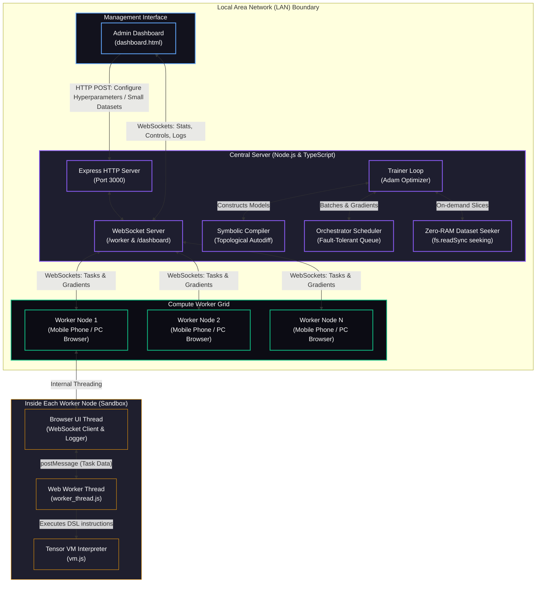

# ⚡ DistCompute: Distributed Browser-Based Deep Learning Training Cluster

A real-time, fault-tolerant, distributed deep learning training system that orchestrates browser-based compute workers (such as mobile phones, tablets, or secondary PCs) to train neural network models. 

By compiling neural networks from a high-level PyTorch-like symbolic API into a custom register-based DSL, the orchestrator divides training batches, schedules slices to connected worker nodes via WebSockets, accumulates their Float32Array gradients, and applies optimization steps (Adam) on the central server.

---

## 📐 System Architecture

The following diagram shows the end-to-end data flow, network boundaries, and multi-threaded execution pipeline of the cluster:



### Architectural Component Breakdown

#### 1. PyTorch-like Symbolic Compiler (`src/compiler/`)
* **Dynamic Computational Graph**: Builds a Directed Acyclic Graph (DAG) when the model layers (e.g. `Embedding`, `LayerNorm`, `CausalSelfAttention`, `TransformerBlock`) are run symbolically.
* **Topological Automatic Differentiation**: Performs a topological sort on active nodes and traverses the DAG in reverse order to inject gradient accumulation instructions.
* **Auto-Broadcasting Reductions**: Automatically detects and inserts broadcasting shape correction nodes (via axis-summing and reshaping opcodes) during backpropagation to match broadcast shapes.
* **DSL Code Generator**: Emits a combined forward and backward assembly instruction script for the VM.

#### 2. Register-Based Tensor VM (`src/public/vm.js`)
* **Strided Layout Tensor**: Tensors store shapes and strides in a 1D Float32Array, enabling zero-copy $O(1)$ transposition and reshaping.
* **Mathematical Operations**: Custom implementations of `matmul` (2D and 3D batched), broadcasting operations (`add`, `sub`, `mul`, `div`), reduction operations (`sum`, `mean` along specified axes), activations (`relu`, `gelu`), softmax, and categorical cross-entropy.
* **Assembly Execution**: Parses and runs compiled DSL instruction sets sequentially, updating local registers.

#### 3. Asynchronous Orchestrator Scheduler (`src/server/orchestrator.ts`)
* **Batch Slicing**: Splits a global training batch (e.g., size 128) into smaller data-parallel slices (e.g., 4 tasks of size 32).
* **Scheduling Queue**: Matches tasks to idle workers and delivers them over WebSocket connection payloads.
* **Fault Tolerance & Heartbeats**:
  - Monitors worker heartbeats every 3 seconds. Workers failing to ping within 45 seconds are dropped.
  - Monitors task completion. If a worker does not return gradients within 40 seconds, the scheduler cancels the task, marks the worker as failed, and pushes the task back to the front of the queue to be processed by a healthy worker.

#### 4. Zero-RAM Dataset Seeker (`src/server/trainer.ts`)
* Prevents browser and server out-of-memory (OOM) crashes on large files (>1GB).
* Rather than loading text contents into memory, the server reads data directly from disk using low-level file descriptor seeks (`fs.readSync`) to fetch randomized training offsets on-demand. This uses $O(1)$ RAM regardless of dataset size.

#### 5. Client Web Workers (`src/public/worker_thread.js`)
* Offloads execution of the Tensor VM to a separate background thread (`Web Worker`). This isolates CPU-intensive matrix calculations, keeping the main browser UI thread fully responsive.

---

## 🤖 Supported Model Architectures

The cluster supports two primary categories of model architectures:

### 1. Legacy Character-level MLP
* A simple feed-forward neural network predicting characters.
* Capacities (hidden dimensions, context length) are configured dynamically via the dashboard UI.

### 2. GPT (Generative Pre-trained Transformer) Models
Our system implements a GPT architecture patterned after **Radford et al. 2018 (GPT-1 / GPT-2 shape)**. Features include:
* Learned token + position embeddings.
* Pre-LayerNorm block structure.
* Causal multi-head self-attention with causal triangular masking.
* GELU-activated feed-forward MLP layers.
* Weight-tied language modeling head.
* Byte-level vocabulary of 256 (no tokenizer vocabulary file required; text is mapped directly to UTF-8 bytes).

We offer two presets:
* **Tiny-GPT (Recommended)**: 2–4 layers, 4 attention heads, 128 embedding dimensions, 512 feed-forward dimensions, and a context window of 128. Totaling **~0.84M parameters**, it is designed to fit comfortably in browser memory sandboxes and runs efficiently on standard client devices.
* **GPT-1 (Canonical reference)**: 12 layers, 12 attention heads, 768 embedding dimensions, 3072 feed-forward dimensions, BPE tokenizer (vocab=40,478), and a context window of 512. Totaling **~117M parameters**, it is a correct mathematical reference but requires ~466MB of weights per task, making it impractical for browser-worker execution.

---

## 📜 DSL Instruction Reference

The compiled assembly language uses a simple text format. Lines beginning with `#` are comments. Each instruction specifies an operation followed by register outputs and inputs:

| Opcode | Arguments | Description |
| :--- | :--- | :--- |
| `matmul` | `out, in1, in2` | Performs matrix multiplication `out = in1 @ in2` (supports 2D and 3D batched inputs with $O(1)$ transpositions for multi-head attention). |
| `transpose` | `out, in` | Transposes the last two dimensions of `in` in $O(1)$ time by swapping strides. |
| `add` | `out, in1, in2` | Element-wise addition with broadcasting support. |
| `sub` | `out, in1, in2` | Element-wise subtraction with broadcasting support. |
| `mul` | `out, in1, in2` | Element-wise multiplication with broadcasting support. |
| `div` | `out, in1, in2` | Element-wise division with broadcasting support. |
| `sum` | `out, in, axis` | Sums elements along the specified axis dimension. |
| `mean` | `out, in, axis` | Computes the mean of elements along the specified axis dimension. |
| `reshape` | `out, in, dim1, dim2...` | Reshapes `in` tensor to the target dimensions in $O(1)$ time. |
| `relu` | `out, in` | Applies the Rectified Linear Unit activation function. |
| `relu_grad` | `out, grad, in` | Computes the backpropagation gradient of the ReLU function. |
| `gelu` | `out, in` | Applies the Gaussian Error Linear Unit activation function. |
| `gelu_grad` | `out, grad, in` | Computes the backpropagation gradient of the GELU function. |
| `embedding` | `out, table, ids` | Gathers row vectors from embedding `table` given token indices `ids`. |
| `embedding_grad` | `gTable, dy, ids` | Scatter-adds gradients `dy` back into the embedding table gradient accumulator `gTable`. |
| `layernorm` | `out, x, gamma, beta` | Applies layer normalization over the last dimension of input `x`. |
| `layernorm_grad` | `dx, dg, db, dy, x, g` | Fused backpropagation through LayerNorm, emitting input, gamma, and beta gradients. |
| `cross_entropy` | `loss, grad, logits, target` | Computes categorical cross-entropy loss and its symbolic gradient. |
| `assign` | `out, in` | Copies values and metadata from `in` to `out`. |

---

## 📈 Stopping Criteria & Cosine LR Schedule

### Token-Based stopping Target
Rather than stopping by optimizer steps, training is governed by the total **Token/Example Target** (`targetTokens`).
* **Tokens Target**: Training counts the cumulative processed text tokens (examples) via `cumulativeExamples`. Once it meets the specified target (e.g. `500,000` tokens), training halts and saves a final checkpoint.
* **Legacy Step Target**: Set `Target Tokens / Examples` to `0` to fall back on `Target Steps` (e.g., stop after exactly 1,000 steps).
* **Throughput and stable ETA**: Progress percent, GFLOPs, and ETA (Estimated Time of Arrival) are computed based on processed tokens and actual examples/sec. This stabilizes the forecasting metrics so that **adding more workers directly decreases the ETA**.

### Warmup & Cosine LR Scheduler
To prevent early divergence and settle into a lower loss minimum, you can configure the Learning Rate schedule:
* **Linear Warmup**: Linearly scales the learning rate from `0` to the target `lr` over the configured `warmupSteps` (default: 200).
* **Cosine Annealing**: Decays the learning rate from its peak value down to a fraction (10%) of the target rate using a cosine curve mapped over the token/step horizon.
* Set `lrSchedule = 'constant'` to bypass the scheduler and use a flat rate.

---

## 💾 Resiliency, Run IDs & Checkpointing

* **Unique Run Identity**: Every start is assigned a unique identifier (e.g., `run-1781454489444-593`). All task payloads are tagged with this run ID so workers log exactly what run they are currently computing.
* **Periodic Checkpointing**: Weights, Adam states ($m$/$v$), steps, epochs, and hyperparameter configuration configurations are automatically saved on the server disk under `checkpoints/<runId>/` every `checkpointEverySteps` (default: 20 steps) and on completion.
* **Seamless Resume**: The **Training Runs** dashboard panel lists all past runs. Clicking the **Resume** button restores the active parameters and optimizer states, allowing you to pick up exactly where you left off. Workers will automatically rejoin the resumed run without manual intervention.

---

## 🐍 Running Exported GPT Models in Python

After training a GPT model in the cluster, you can download the weights and run text generation locally using PyTorch and Hugging Face.

### Step 1: Download Weights
1. Open the Admin Dashboard.
2. Click the **"Download Weights"** button. This downloads a JSON file containing the trained matrices and character lookup dictionaries (e.g. `model_weights.json`).

### Step 2: Install Python Prerequisites
Ensure you have Python 3 and the required libraries installed:
```bash
pip install torch transformers numpy
```

### Step 3: Run the Generation Script
Run the built-in python utility to load the JSON weights into a standard Hugging Face `GPT2LMHeadModel` and generate text:
```bash
python tools/run_exported_model.py --weights model_weights.json --prompt "To be, or not to be" --tokens 200 --temperature 0.8
```

#### CLI Parameters:
* `--weights` (Required): Path to your downloaded `model_weights.json` file.
* `--prompt` (Default: "To be, or not to be"): Starting seed string for text generation.
* `--tokens` (Default: 200): Number of tokens to generate.
* `--temperature` (Default: 0.8): Creativity scaling factor (use `0` for greedy/argmax decoding).
* `--manifest` (Optional): Path to the model's manifest file (e.g. `models/tiny-gpt.manifest.json`) for loading exact hyperparameters.

---

## ⚙️ Installation Guide

### Prerequisites
* **Node.js**: Version 18.0 or higher
* **npm**: Version 9.0 or higher (bundled with Node.js — installing Node.js installs npm automatically)

> **`zsh: command not found: npm`?** This means Node.js is not installed or is not on your `PATH`. Install Node.js (which includes npm) from [nodejs.org](https://nodejs.org/) or via a version manager such as [nvm](https://github.com/nvm-sh/nvm), then restart your terminal and verify with `node -v` and `npm -v`.

### 1. Server Setup
Clone the repository and install dependencies:
```bash
git clone https://github.com/ravikadam/distcompute.git
cd distcompute
npm install
```

### 2. Build the Project
Compile the TypeScript files and copy static frontend assets to the build folder:
```bash
npm run build
```

> **`sh: tsc: command not found`?** TypeScript is installed locally as a project dev dependency, not globally, so the bare `tsc` command is not on your `PATH`. Always run the build through npm (`npm run build`) or invoke the local binary with `npx tsc`. Run `npm install` first so the local `tsc` exists in `node_modules/.bin`. (Alternatively, install it globally with `npm install -g typescript`.)

### 3. Run Math and VM Tests
Verify the mathematical accuracy of the Tensor VM operations, compiler autodiff, and regression blocks:
```bash
npm test
```

### 4. Verify Autodiff & Gradient Checking
Verify the compiler's symbolic backpropagation against numerical finite-difference gradients:
```bash
npx ts-node src/tests/test_compiler.ts
```

---

## 📱 Compute Worker Node Join Guide

Workers execute training computations in their browser sandbox. Setting up a compute node requires no software downloads or NPM installations—it is entirely client-side.

```
                    ┌────────────────────────┐
                    │   Central Orchestrator │
                    │   Server (192.168.1.5) │
                    └───────────▲────────────┘
                                │ (Port 3000)
              ┌─────────────────┴─────────────────┐
              │   Local Wi-Fi Router / LAN        │
              └─────────▲──────────────────▲──────┘
                        │                  │
               ┌────────┴──────┐    ┌──────┴─────────┐
               │ Mobile Phone  │    │ Laptop Browser │
               │ (Compute Node)│    │ (Compute Node) │
               └───────────────┘    └────────────────┘
```

### Step 1: Network Requirements
* Ensure that the server machine and the worker devices (phones, tablets, laptops) are connected to the **same local area network (Wi-Fi or LAN)**.
* Devices on guest networks or isolated APs will not be able to ping the server.

### Step 2: Access the Worker Interface
1. Run the server (see **Usage Guide** below). Note the `Worker Join URL` displayed in the terminal logs (e.g., `http://192.168.1.5:3000/worker.html`).
2. Open the browser (Safari, Chrome, Firefox) on the worker device and enter the `Worker Join URL`.
3. The page will load a dashboard and automatically attempt to establish a WebSocket connection.

### Step 3: Keep the Worker Node Active
* **Disable Screen Lock (Critical for Mobile)**:
  * **iOS**: Go to **Settings** ➔ **Display & Brightness** ➔ **Auto-Lock** ➔ Set to **Never**.
  * **Android**: Go to **Settings** ➔ **Display** ➔ **Screen Timeout** ➔ Set to maximum allowed (or enable "Stay Awake" in Developer Options while charging).
* **Foregrounding**: Keep the browser tab active and in the foreground. Mobile operating systems suspend WebSocket traffic and Web Workers when a tab is minimized or backgrounded.

### Step 4: Custom Connection (Optional)
If a node does not auto-connect:
1. Enter the server's WebSocket address manually in the **"Orchestrator WebSocket Endpoint"** field (e.g. `ws://192.168.1.5:3000/worker`).
2. Click **"Connect Node"**.
3. A successful connection is indicated by the green status light (**"Connected"**).

---

## 🚀 Usage Guide

### 1. Start the Server
Run the startup command:
```bash
npm start
```
The server binds to `0.0.0.0` (all interfaces) to allow network access. The startup log will display connection details:
```text
🚀 Distributed Compute Server listening on 0.0.0.0:3000
🖥️  Local Dashboard: http://localhost:3000/dashboard.html
🖥️  Network Dashboard: http://192.168.1.5:3000/dashboard.html
📱 Worker Join URL: http://192.168.1.5:3000/worker.html
```

### 2. Configure Training Parameters
1. Open the **Admin Dashboard** (`http://localhost:3000/dashboard.html`).
2. Adjust model and hyperparameter values:
   * **Learning Rate**: Step scale of Adam updates.
   * **Hidden Dimension**: Layer capacity of the MLP model.
   * **Context Length**: Number of characters the model reads to predict the next character.
   * **Batch Size**: Global training batch size.
3. Configure the training text corpus:
   * **Files under 20MB**: Drag-and-drop or select the file using the dashboard file uploader.
   * **Files over 1GB**: Place the text file on the server's local storage disk, copy its absolute file path, and paste it into the **"OR Server-Side Dataset File Path"** input field.
4. Click **"Apply Parameters & Reset Weights"**. The compiler will generate the model DSL and reset weights.

### 3. Run Training
1. Open the **Worker Join URL** on your mobile phones or other devices. Verify they show up in the **Active Compute Workers** table on the Admin Dashboard.
2. Click **"Start Training"** on the dashboard.
3. The dashboard will display live progress metrics:
   * **Loss Chart**: Real-time line graph plotting convergence.
   * **Global Throughput**: Examples processed per second.
   * **Sampled Prediction Stream**: Live text completions generated by the model.
4. To backup or export the trained model parameters, click the **"Download Weights"** button. This downloads a structured JSON file containing all weights, biases, and character mapping dictionaries.

---

## 🛠️ Troubleshooting Connection and Firewalls

If workers fail to connect or display network timeouts:

### 1. Firewall Blocks
By default, macOS and Windows block incoming TCP traffic on port `3000`.
* **macOS**: Go to **System Settings** ➔ **Network** ➔ **Firewall** ➔ Disable, or add an inbound exception rule for Node.js.
* **Windows**: Run the following in Administrator PowerShell to allow port 3000 traffic:
  ```powershell
  New-NetFirewallRule -DisplayName "DistCompute" -Direction Inbound -Action Allow -Protocol TCP -LocalPort 3000
  ```

### 2. Ping Test
On a laptop worker connected to the same Wi-Fi, open the terminal and ping the server's LAN IP:
```bash
ping 192.168.1.5
```
If packets are lost, double-check that the devices are on the same Wi-Fi router subnet and that "Client Isolation" is disabled in the router settings.
